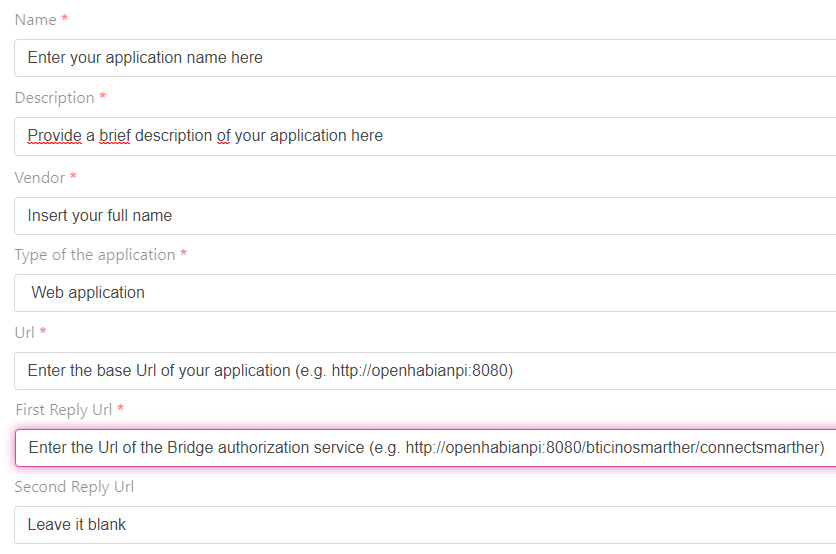
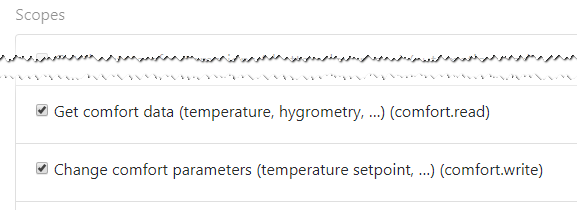
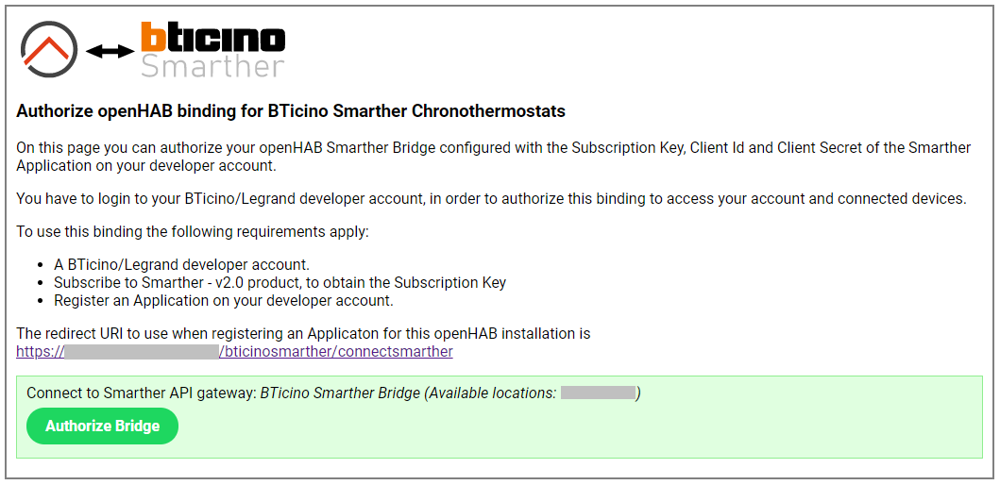
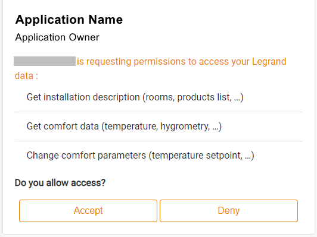

<!-- Attention authors: Do not edit directly. Please add your changes to the appropriate source repository -->



# BTicinoSmarther Binding

The BTicino Smarther binding implements a bridge to the Legrand/BTicino Smarther v2.0 API and allows you to control your BTicino Smarther chronothermostat units with openHAB, making it possible to discover Smarther units connected to your Legrand/BTicino Smarther account.

Smarther chronothermostat is produced by [BTicino](https://www.bticino.com/products-catalogue/smarther-the-connected-thermostat/), has its own API set and does not support the OpenWebNet protocol.

## Supported Things

All BTicino Smarther Chronothermostat device models should be discoverable through this binding:

* Flush mounting installation item (X8000)
* Wall installation item (X8000W)

If you can control them from BTicino Thermostat mobile app on your iPhone/Android you should be able to add it as a thing.

## Discovery

As long as BTicino Smarther Chronothermostat devices are available in the locations registered on the user account configured with the bridge they should show up whenever you initiate discovery of things.

If no devices are showing up, try to connect to the device(s) from your smartphone to make sure the device(s) are in use by your user account.

The discovery of devices in the Smarther API is based on what is known by Legrand.
There is difference between e.g. smartphones and computers which can discover devices on the local network and the Smarther API which is not able to do so; it only knows about a device if your account is currently associated with the device.

## Thing Configuration

Each Bridge item requires you to register an Application with [Legrand Developer portal](https://developer.legrand.com).
This will get you a set of Client ID and Client Secret parameters to be used in the [Bridge Configuration](#bridge-configuration) phase.

Optionally, if you want to later receive push notifications on the status of your units, consider to make your openHAB installation reachable in https from a public IP or domain (see [Note on notifications](#note-on-notifications)).

The following configuration options are available on the BTicino Smarther Bridge thing:

| Parameter             | Description                                                                                                                                        | Condition |
|-----------------------|----------------------------------------------------------------------------------------------------------------------------------------------------|-----------|
| subscriptionKey       | This is the Primary Key provided by Legrand when you create a new Account and subscribe to a product                                               | Required  |
| clientId              | This is the Client ID provided by Legrand when you add a new Application for openHAB to your Legrand account                                       | Required  |
| clientSecret          | This is the Client Secret provided by Legrand when you add a new Application for openHAB to your Legrand account                                   | Required  |
| useNotifications      | ON = the bridge subscribes to receive push notifications on devices status change; OFF = status updates are requested (pull) on a periodical basis |           |
| statusRefreshPeriod   | This is the frequency of the polling requests to the Smarther API to update the bridge status (in minutes)                                         |           |

The following configuration options are available on the BTicino Smarther Chronothermostat thing:

| Parameter             | Description                                                                                                                                        | Condition |
|-----------------------|----------------------------------------------------------------------------------------------------------------------------------------------------|-----------|
| plantId               | This is the Plant Id of the location the Chronothermostat module is installed in, provided by Smarther API                                         | Read-only |
| moduleId              | This is the Module Id of the Chronothermostat module, provided by Smarther API                                                                     | Read-only |
| settingsAutoupdate    | ON = the thermostat settings are aligned with current status whenever it changes; OFF = settings are aligned to status only upon initialization    |           |
| programsRefreshPeriod | This is the frequency the Smarther API gateway is called to refresh Programs list used in "automatic" mode (in hours)                              |           |
| numberOfEndDays       | This is the number of days to be displayed in module settings, as options list for "End Date" field in "manual" mode                               |           |
| statusRefreshPeriod   | This is the frequency of the polling requests to the Smarther API to update the module status and sensor data (in minutes)                         |           |

### Account Creation

Follow the instructions in the tutorial [here](https://developer.legrand.com/tutorials/getting-started/), under: 

* Step 1 : Create an account
* Step 2 : Subscribe to a product and get subscription key

There's also a Step 3 in this tutorial, you can skip it as not needed to complete this process.
Simply write down your "Primary Key" as it will be needed later on in the bridge configuration phase.

### Application Creation

Follow the instructions in the tutorial [here](https://developer.legrand.com/tutorials/create-an-application/), under: 

* Step 1 : Register your application
* Step 2 : Check scopes
* Step 3 : Getting application details

When registering your new Legrand Application for openHAB BTicino Smarther Bridge you have to specify the allowed Reply URL, aka white-listed address.
Here you have to specify the URL to the Bridge Authorization page on your server.

For example if you run your openHAB server on http://openhabianpi:8080 you should set `http://openhabianpi:8080/bticinosmarther/connectsmarther` as the "First Reply URL" required field in Step 1.
Other Reply URLs (second, third, etc.) you can leave them blank.

This is **very important** since the authorize process with Legrand takes place using your client web browser and Legrand will have to know the right URL to your openHAB server for the authorization to be completed.
When you have authorized with Legrand, this Redirect URI is where authorization tokens for your openHAB BTicino Smarther Brigde will be sent and they have to be received by the servlet on `/bticinosmarther/connectsmarther`.



On Step 2, please make sure to select both `comfort.read` and `comfort.write` scopes, as they're mandatory for the bridge to manage its chronothermostat devices.



Usually, Step 3 is then completed by Legrand within 1-2 days and you'll receive an email containing your application's Client ID and Client Secret.

### Note On Notifications

If you want to later receive push notifications (device status) from Legrand for this application, you must have your openHAB server reachable from a public IP/address and use the related public IP/address and public port when filling-in the "Reply URL" field in Step 1.

### Bridge Configuration

1. Install the binding and make sure the _BTicino Smarther Binding_ is listed on your server, if you have not already done so.
2. Complete the [Account Creation](#account-creation) and [Application Creation](#application-creation) steps, if you have not already done so.
3. Make sure you have your Legrand account _Primary Key_ and your Legrand application _Client ID_ and _Client Secret_ identities available.
4. Go to your preferred openHAB admin UI and add a new Thing - select the **"BTicino Smarther Bridge"**.
5. Choose new Id for the bridge, unless you like the generated one.
6. Put in your _Primary Key_ (in _Subscription Key_ field), _Client ID_ and _Cliend Secret_ in their respective fields of the bridge configuration.
7. Set _Use Notifications_ to `ON` if your openHAB server is reachable from a public https URL (see [Note on notifications](#note-on-notifications)), set `OFF` otherwise.
8. You can leave the _Bridge Status Refresh Period_ as is.
9. Save the bridge.
10. The bridge thing will stay in state _INITIALIZING_ and eventually go _OFFLINE_ - this is fine, as you now have to authorize this bridge with Legrand.
11. Go to the authorization page of your server (see [Application Creation](#application-creation)) `http://<your openHAB address>:<your openHAB port>/bticinosmarther/connectsmarther`; your newly added bridge should be listed there (along with the available locations).
12. Press the _"Authorize Bridge"_ button; this will take you either to the login page of Legrand portal or directly to the authorization screen.
13. Login and/or authorize the application; if the Reply URL is correct you will be returned and the entry should show your bridge is authorized with your Client ID; otherwise, go back to your application configuration on Legrand portal and ensure you have set the right Reply URL (see [Troubleshooting](#troubleshooting) below).
14. The bridge will be updated with a refresh token and go _ONLINE_ (the refresh token is used to re-authorize the bridge with Legrand Smarther API whenever required).






Now that you have got your bridge _ONLINE_ it is time to discover your devices! Go to Paper UI Inbox and search for **"BTicino Smarther Chronothermostat"** things.
Any BTicino Smarther Chronothermostat device currently available on your account should show up immediately.

If no devices show up you may have to trigger the openHAB discovery several times as bridge will only find active devices known by the Smarther API at the time the discovery is triggered.

Should the bridge configuration be broken for any reason, the authorization procedure can be reinitiated from step 11 whenever required.
You can force reinitialization by authorizing again on the `/bticinosmarther/connectsmarther` page, even if the page shows it as already authorized. This will reset the refresh token.

### Troubleshooting

When configuring the bridge (see step 13 [here](#thing-configuration)), you can receive the following error from Legrand portal:

```
{
  "error": "invalid_request",
  "error_description": "The reply url host xxxxx doesn't match with the ones configured on the application"
}
```

This means you've either opened the `/bticinosmarther/connectsmarther` page from the wrong address or set the wrong "Reply URL" attribute in your application (see step 1 [here](#application-creation)).
Please remember these two strings must match for authentication process to work.

To solve the issue, either:

* Correct the address you're accessing the `/bticinosmarther/connectsmarther` page from, to match the "Reply URL" attribute registered in your application, or
* Should you have specified a wrong "Reply URL" attribute in your application, go to the Legrand portal and correct it accordingly then resubmit the application for approval.

## Channels

### Bridge

The channels on the bridge are the ones used to get details of current communication with Smarther API on the Legrand account associated with the bridge.

**Status Channels:**

The following channels represent the current operational status of the bridge and must all be referenced with the `status#` prefix.

| Channel Type ID   | Item Type            | Read/Write | Description                                                                                                      | Type     |
|-------------------|----------------------|------------|------------------------------------------------------------------------------------------------------------------|----------|
| apiCallsHandled   | Number               | Read-only  | The total number of API calls handled by the bridge                                                              | Common   |
| notifsReceived    | Number               | Read-only  | The total number of push notifications received by the bridge                                                    | Common   |
| notifsRejected    | Number               | Read-only  | The total number of push notifications rejected by the bridge (part of the received ones)                        | Common   |

**Configuration Channels:**

The following channels represent convenience configuration channels for the bridge and must all be referenced with the `config#` prefix.

| Channel Type ID   | Item Type            | Read/Write | Description                                                                                                      | Type     |
|-------------------|----------------------|------------|------------------------------------------------------------------------------------------------------------------|----------|
| fetchLocations    | Switch               | Read-write | Trigger to manually fetch the updated client locations list from Smarther API                                    | Advanced |

### Devices

**Measures Channels:**

The following channels represent the measures taken from the module on-board sensors and must all be referenced with the `measures#` prefix.

| Channel Type ID   | Item Type            | Read/Write | Description                                                                                                      | Type     |
|-------------------|----------------------|------------|------------------------------------------------------------------------------------------------------------------|----------|
| temperature       | Number:Temperature   | Read-only  | Indoor temperature as measured by the sensor (precision of 1/10 degree Celsius)                                  | Common   |
| humidity          | Number:Dimensionless | Read-only  | Indoor humidity as measured by the sensor (in percentage)                                                        | Common   |

**Status Channels:**

The following channels represent the current operational status of the module and must all be referenced with the `status#` prefix.

| Channel Type ID   | Item Type            | Read/Write | Description                                                                                                      | Type     |
|-------------------|----------------------|------------|------------------------------------------------------------------------------------------------------------------|----------|
| state             | Switch               | Read-only  | Current operational state of the module                                                                          | Common   |
| function          | String               | Read-only  | Current operational function set on the module (HEATING, COOLING)                                                | Advanced |
| mode              | String               | Read-only  | Current operational mode set on the module (AUTOMATIC, MANUAL, BOOST, OFF, PROTECTION)                           | Common   |
| temperature       | Number:Temperature   | Read-only  | Current operational target temperature set on the module (precision of 1/10 degree Celsius)                      | Common   |
| program           | String               | Read-only  | Current operational program set on the module (valid only for "Automatic" mode)                                  | Common   |
| endTime           | String               | Read-only  | Current operational end time set on the module                                                                   | Common   |
| temperatureFormat | String               | Read-only  | Current operational temperature format of the module                                                             | Advanced |

**Settings Channels:**

The following channels represent the new operational settings to be applied to the module and must all be referenced with the `settings#` prefix.

| Channel Type ID   | Item Type            | Read/Write | Description                                                                                                      | Type     |
|-------------------|----------------------|------------|------------------------------------------------------------------------------------------------------------------|----------|
| mode              | String               | Read-write | New operational mode to be set (AUTOMATIC, MANUAL, BOOST, OFF, PROTECTION)                                       | Common   |
| temperature       | Number:Temperature   | Read-write | New operational set-point temperature to be set (valid only for "Manual" mode, precision of 1/10 degree Celsius) | Common   |
| program           | Number               | Read-write | New operational program to be set (valid only for "Automatic" mode)                                              | Common   |
| boostTime         | Number               | Read-write | New operational boost time to be set (valid only for "Boost" mode)                                               | Common   |
| endDate           | String               | Read-write | New operational end date to be set (valid only for "Manual" mode)                                                | Common   |
| endHour           | Number               | Read-write | New operational end hour to be set (valid only for "Manual" mode)                                                | Common   |
| endMinute         | Number               | Read-write | New operational end minute to be set (valid only for "Manual" mode)                                              | Common   |
| power             | Switch               | Read-write | Power on, send new operational settings to the module                                                            | Common   |

_**Note:**_ The `program` and `endDate` channels are Selection channels.
They are dynamically populated, respectively with the module specific set programs and the next N days (starting from _"Today"_, N driven by the `numberOfEndDays` device configuration option).

**Configuration Channels:**

The following channels represent convenience configuration channels for the module and must all be referenced with the `config#` prefix.

| Channel Type ID   | Item Type            | Read/Write | Description                                                                                                      | Type     |
|-------------------|----------------------|------------|------------------------------------------------------------------------------------------------------------------|----------|
| fetchPrograms     | Switch               | Read-write | Trigger to manually fetch the updated module programs list from Smarther API                                     | Advanced |

## Full Example

In this example there is a bridge configured with Thing ID **mybridge**:

bticinosmarther.things:

```
Bridge bticinosmarther:bridge:mybridge "BTicino Smarther Bridge" [subscriptionKey="<your primary key>" clientId="<your client id>", clientSecret="<your client secret>"] {
  Thing module thermo1 "Thermo 1" [plantId="<location plant id>" moduleId="<chronothermostat module id>"]
  Thing module thermo2 "Thermo 2" [plantId="<location plant id>" moduleId="<chronothermostat module id>"]
}
```

bticinosmarther.items:

```
// Measures items
Number:Temperature   smaTemperature "In Temperature [%.1f %unit%]"  { channel="bticinosmarther:module:mybridge:thermo1:measures#temperature" }
Number:Dimensionless smaHumidity    "In Humidity [%.1f %unit%]"     { channel="bticinosmarther:module:mybridge:thermo1:measures#humidity" }

// Status items
Switch               smaCurState    "Cur State [%s]"                { channel="bticinosmarther:module:mybridge:thermo1:status#state" }
String               smaCurMode     "Cur Mode [%s]"                 { channel="bticinosmarther:module:mybridge:thermo1:status#mode" }
Number:Temperature   smaCurPoint    "Cur Temperature [%.1f %unit%]" { channel="bticinosmarther:module:mybridge:thermo1:status#temperature" }
String               smaCurProgram  "Cur Program [%s]"              { channel="bticinosmarther:module:mybridge:thermo1:status#program" }
String               smaCurTime     "Cur Timer [%s]"                { channel="bticinosmarther:module:mybridge:thermo1:status#endTime" }

// Settings items
String               smaSetMode     "Set Mode [%s]"                 { channel="bticinosmarther:module:mybridge:thermo1:settings#mode" }
Number:Temperature   smaSetPoint    "Set Temperature [%.0f %unit%]" { channel="bticinosmarther:module:mybridge:thermo1:settings#temperature" }
Number               smaSetProgram  "Set Program [%s]"              { channel="bticinosmarther:module:mybridge:thermo1:settings#program" }
Number               smaSetBoost    "Set Boost Time []"             { channel="bticinosmarther:module:mybridge:thermo1:settings#boostTime" }
String               smaSetDate     "Set End Date [%s]"             { channel="bticinosmarther:module:mybridge:thermo1:settings#endDate" }
Number               smaSetHour     "Set End Hour [%02d:00]"        { channel="bticinosmarther:module:mybridge:thermo1:settings#endHour" }
Number               smaSetMinute   "Set End Minute [hh:%02d]"      { channel="bticinosmarther:module:mybridge:thermo1:settings#endMinute" }
Switch               smaSetPower    "Apply Changes"                 { channel="bticinosmarther:module:mybridge:thermo1:settings#power" }

// Convenience items
Switch               smaDisplayTime
```

bticinosmarther.sitemap:

```
sitemap bticinosmarther label="BTicino Smarther Sitemap" {

  Frame label="Smarther Measures" {
    Text item=smaTemperature
    Text item=smaHumidity
  }

  Frame label="Smarther Status" {
    Text item=smaCurState
    Text item=smaCurMode
    Text item=smaCurPoint
    Text item=smaCurProgram
    Text item=smaCurTime
  }

  Frame label="Smarther Settings" {
    Selection item=smaSetMode
    Selection item=smaSetProgram visibility=[smaSetMode=="AUTOMATIC"]
    Setpoint  item=smaSetPoint   minValue=7 maxValue=24 step=1 visibility=[smaSetMode=="MANUAL"]
    Selection item=smaSetDate    visibility=[smaSetMode=="MANUAL"]
    Setpoint  item=smaSetHour    minValue=0 maxValue=23 step=1 visibility=[smaDisplayTime==ON]
    Setpoint  item=smaSetMinute  minValue=0 maxValue=45 step=15 visibility=[smaDisplayTime==ON]
    Switch    item=smaSetBoost   mappings=[30="30'", 60="60'", 90="90'"] visibility=[smaSetMode=="BOOST"]
    Switch    item=smaSetPower   mappings=["ON"="Start"]
  }
}
```

bticinosmarther.rules:

```
rule "BTicino Smarther - Set time visibility flag"
when
    Item smaSetMode received update or Item smaSetDate received update
then
    if (smaSetMode.state == "MANUAL" && smaSetDate.state != "") {
        smaDisplayTime.sendCommand(ON)
    }
    else {
        smaDisplayTime.sendCommand(OFF)
    }
end
```

## Binding Model And Smarther API

The model of the binding is such that the bridge takes care of all the remote communications with the Smarther API in the context of a specific user.
All devices (chronothermostats modules) currently associated with the user account are available to control.

Legrand/BTicino Smarther topology considers the following dimensions:

* topology : is the whole network of devices associated with a user account
* plant    : is the location where a module is installed (0..N plants per topology)
* module   : is the chronothermostat installed in a location (0..N modules per location)

You can add multiple bridges to allow controlling devices in the context of multiple Legrand user accounts.

Legrand manages the push notifications on device status via MS Azure C2C queues.
Each bridge registers itself to the queue, takes care of incoming notifications on behalf of its managed devices and dispatches each payload to the related device.

The binding uses the [Smarther API v2.0](https://portal.developer.legrand.com/docs/services/smartherV2/operations/Chronothermostat-Measures).
The main gap between the API and Smarther mobile app is that the latter also allows you to create new programs.
