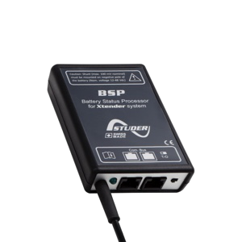
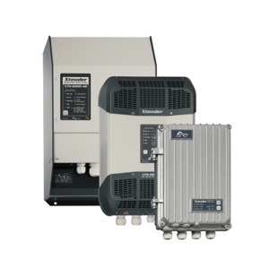
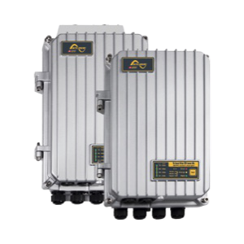
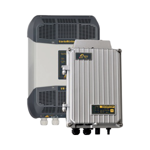

<!-- Attention authors: Do not edit directly. Please add your changes to the appropriate source repository -->



# Studer

This extension adds support for the Studer protocol.

Studer Innotec, founded in 1987 by Roland Studer, is an ISO certified company that develops and manufactures inverters, inverter/chargers and MPPT solar charge controllers to communicate over the Modbus protocol entirely in Switzerland 

For a list of certified products see this page: https://www.studer-innotec.com/

## Supported Things

This bundle adds the following thing type to the Modbus binding.
Note, that the things will show up under the Modbus binding.

| Thing Type IDs | Description                                                                                                          | Picture                             |
|----------------|----------------------------------------------------------------------------------------------------------------------|-------------------------------------|
| bsp            | For BSP that offer a highly precise measuring for Xtender, VarioTrack and VarioString systems                        |                  |
| xtender        | For the Xtender models for system capacities from 0.5kVA to 72kVA that allow for the optimal use of available energy |          |
| variotrack     | For the VarioTrack models of MPPT solar charge controllers for systems with solar PV capacity from 1 - 75kWp         |    |
| variostring    | For the VarioString models of MPPT solar charge controllers for systems with solar PV capacity from 4                |  |


## Thing Configuration

You need first to set up a Serial Modbus bridge according to the Modbus documentation.
Things in this extension will use the selected bridge to connect to the device.

For defining a thing textually, you have to find out the start address of the model block and the length of it.
While the length is usually fixed, the address is not.
Please refer to your device's vendor documentation how model blocks are laid for your equipment.

The following parameters are valid for all thing types:

| Parameter | Type    | Required | Default if omitted      | Description                                                                |
|-----------|---------|----------|-------------------------|----------------------------------------------------------------------------|
| address   | integer | yes      | `first slave of device` | Address of slave                                                           |
| refresh   | integer | yes      | 5                       | Poll interval in seconds. Increase this if you encounter connection errors |

## Channels

The following Channels, and their associated channel types are shown below divided by device.

#### BSP 

All channels read for a BSP device

| Channel            | Type                     | Description           |
| ------------------ | ------------------------ | --------------------- |
| power              | Number:Power             | Power                 |
| batteryVoltage     | Number:ElectricPotential | Battery voltage       |
| batteryCurrent     | Number:ElectricCurrent   | Battery current       |
| stateOfCharge      | Number:Dimensionless     | State of Charge       |
| batteryTemperature | Number:Temperature       | Battery temperature   |

#### Xtender 

All channels read for a Xtender device

| Channel           | Type                     | Description             |
| ----------------- | ------------------------ | ----------------------- |
| inputVoltage      | Number:ElectricPotential | Input voltage           |
| inputCurrent      | Number:ElectricCurrent   | Input current           |
| inputActivePower  | Number:Power             | Input active power      |
| inputFrequency    | Number:Frequency         | Input frequency         |
| outputVoltage     | Number:ElectricPotential | Output voltage          |
| outputCurrent     | Number:ElectricCurrent   | Output current          |
| outputActivePower | Number:Power             | Output active power     |
| outputFrequency   | Number:Frequency         | Output frequency        |
| operatingState    | String                   | Operating state         |
| stateInverter     | String                   | State of the inverter   |

#### VarioTrack 

All channels read for a VarioTrack device

| Channel              | Type                     | Description                               |
| -------------------- | ------------------------ | ----------------------------------------- |
| modelVarioTrack      | String                   | Model of VarioTrack                       |
| voltagePVGenerator   | Number:ElectricPotential | Voltage of the PV generator               |
| powerPVGenerator     | Number:Power             | Power of the PV generator                 |
| productionCurrentDay | Number:Energy            | Production in (kWh) for the current day   |
| batteryVoltage       | Number:ElectricPotential | Battery voltage                           |
| batteryCurrent       | Number:ElectricCurrent   | Battery current                           |
| operatingMode        | String                   | Operating mode                            |
| stateVarioTrack      | String                   | State of the VarioTrack                   |

#### VarioString 

All channels read for a VarioString device

| Channel                 | Type                     | Description                                   |
| ----------------------- | ------------------------ | --------------------------------------------- |
| PVVoltage               | Number:ElectricPotential | PV voltage                                    |
| PVCurrent               | Number:ElectricCurrent   | PV current                                    |
| PVPower                 | Number:Power             | PV power                                      |
| ProductionPVCurrentDay  | Number:Energy            | Production PV in (kWh) for the current day    |
| PV1Voltage              | Number:ElectricPotential | PV1 voltage                                   |
| PV1Current              | Number:ElectricCurrent   | PV1 current                                   |
| PV1Power                | Number:Power             | PV1 power                                     |
| ProductionPV1CurrentDay | Number:Energy            | Production PV1 in (kWh) for the current day   |
| PV2Voltage              | Number:ElectricPotential | PV2 voltage                                   |
| PV2Current              | Number:ElectricCurrent   | PV2 current                                   |
| PV2Power                | Number:Power             | PV2 power                                     |
| ProductionPV2CurrentDay | Number:Energy            | Production PV2 in (kWh) for the current day   |
| batteryVoltage          | Number:ElectricPotential | Battery voltage                               |
| batteryCurrent          | Number:ElectricCurrent   | Battery current                               |
| PVMode                  | String                   | PV operating mode                             |
| PV1Mode                 | String                   | PV1 operating mode                            |
| PV2Mode                 | String                   | PV2 operating mode                            |
| stateVarioString        | String                   | State of the VarioString                      |

## Example

### Thing Configuration

```
Bridge modbus:serial:bridge [port="/dev/ttyUSB0",baud=9600,dataBits=8,parity="even",stopBits="1.0",encoding="rtu"]
..or..
Bridge modbus:tcp:bridge [host="192.168.178.56", port=502, rtuEncoded=true]

...

Thing modbus:xtender:bridge:xtenderdevice "Xtender" (modbus:serial:modbusbridge) [ slaveAddress=10, refresh=5 ]
```

Note: Make sure that refresh and slave address are numerical, without quotes.

### Item Configuration

```
Number XtenderStuderThing_InputVoltage "Input Voltage [%.2f %unit%]"  
{channel="modbus:xtender:bridge:xtenderdevice:inputVoltage"}

Number XtenderStuderThing_InputCurrent "Input Current [%.2f %unit%]"  {channel="modbus:xtender:bridge:xtenderdevice:inputCurrent"}

String XtenderStuderThing_StateInverter "State: [%s]" {channel="modbus:xtender:bridge:xtenderdevice:stateInverter"}
```

### Sitemap Configuration

```
Text item=XtenderStuderThing_InputVoltage
Text item=XtenderStuderThing_InputCurrent
Text item=XtenderStuderThing_StateInverter
            
Chart item=XtenderStuderThing_InputVoltage period=D refresh=600000
Chart item=XtenderStuderThing_InputCurrent period=D refresh=30000
```