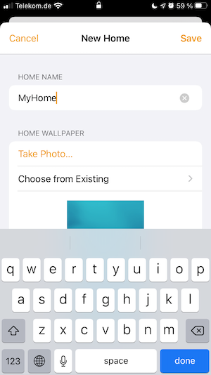
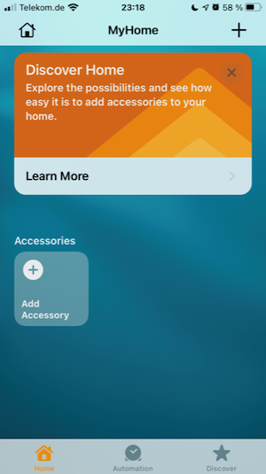
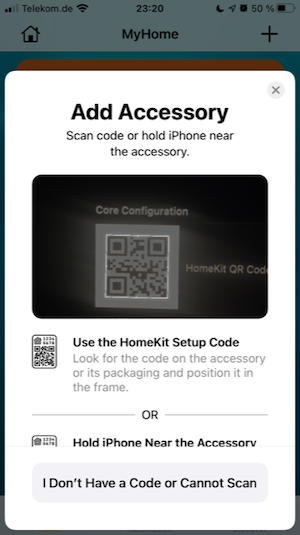
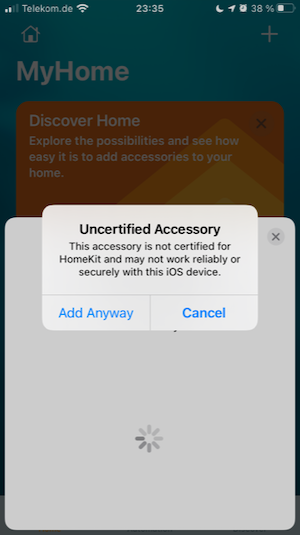
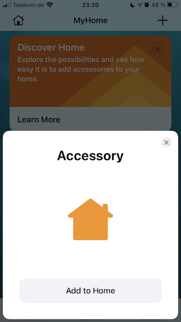
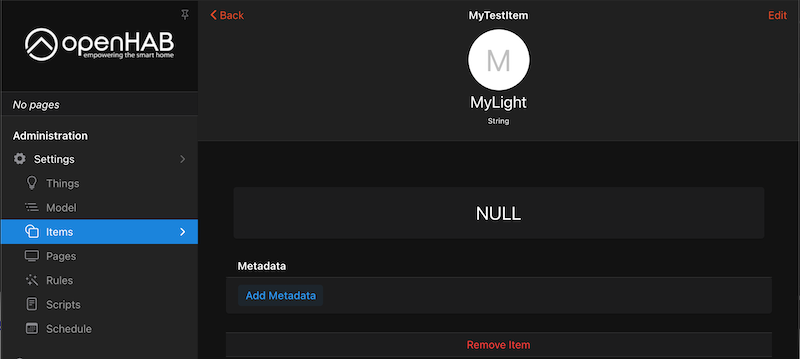
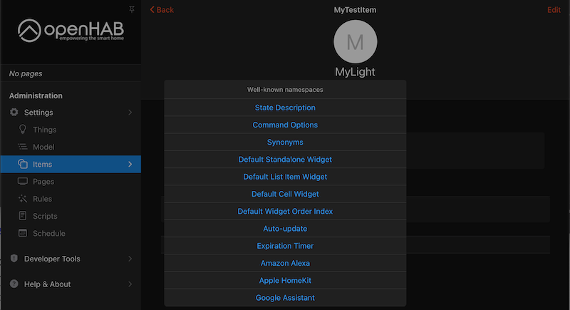
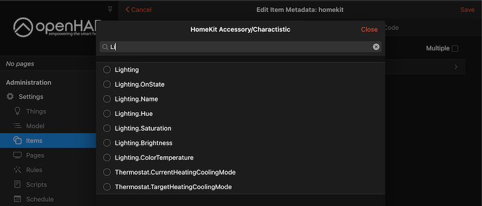
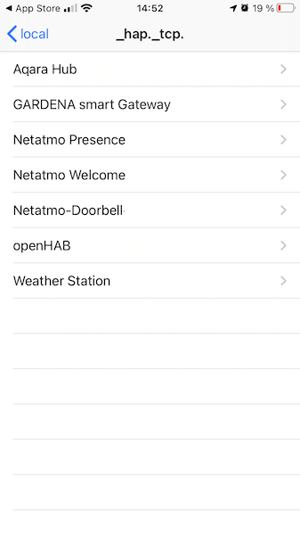

<!-- Attention authors: Do not edit directly. Please add your changes to the appropriate source repository -->



# HomeKit Add-on

This is an add-on that exposes your openHAB system as a bridge over the HomeKit protocol.

Using this add-on, you will be able to control your openHAB system using Apple's Siri, or any of a number of HomeKit enabled iOS apps.
In order to do so, you will need to make some configuration changes.
HomeKit organizes your home into "accessories" that are made up of a number of "characteristics".
Some accessory types require a specific set of characteristics.

HomeKit integration supports following accessory types:

- Switchable
- Outlet
- Lighting (simple, dimmable, color)
- Fan
- Thermostat
- Heater / Cooler
- Lock
- Security System
- Garage Door Opener
- Motorized Door
- Motorized Window
- Window Covering/Blinds
- Valve
- Air Quality Sensor
- Contact Sensor
- Leak Sensor
- Motion Sensor
- Occupancy Sensor
- Smoke Sensor
- Temperature Sensor
- Humidity Sensor
- Light Sensor
- Carbon Dioxide Sensor
- Carbon Monoxide Sensor

## Quick start

- install homekit binding via UI
  
- add metadata to an existing item (see [UI based configuration](#UI-based-Configuration))
  
- go to scan QR code from UI->Setting-HomeKit Integration
  
  
  
- open home app on your iPhone or iPad
- create new home
  
  
  
- add accessory
  
  
  
- scan QR code from UI->Setting-HomeKit Integration
  
    

- click "Add Anyway"
  
  
  
- follow the instruction of the home app wizard
  
  
  
Add metadata to more item or fine-tune your configuration using further settings


## Global Configuration

Your first step will be to create the `homekit.cfg` in your `$OPENHAB_CONF/services` folder.
At the very least, you will need to define a pin number for the bridge.
This will be used in iOS when pairing. The pin code is in the form "###-##-###".
Requirements beyond this are not clear, and Apple enforces limitations on eligible pins within iOS.
At the very least, you cannot use repeating (111-11-111) or sequential (123-45-678) pin codes.
If your home network is secure, a good starting point is the pin code used in most sample applications: 031-45-154.
Check for typos in the pin-code if you encounter "Bad Client Credential" errors during pairing.

Other settings, such as using Fahrenheit temperatures, customizing the thermostat heat/cool/auto modes, and specifying the interface to advertise the HomeKit bridge (which can be edited in Paper UI standard mode) are also illustrated in the following sample:

```
org.openhab.homekit:port=9124
org.openhab.homekit:pin=031-45-154
org.openhab.homekit:useFahrenheitTemperature=true
org.openhab.homekit:thermostatTargetModeCool=CoolOn
org.openhab.homekit:thermostatTargetModeHeat=HeatOn
org.openhab.homekit:thermostatTargetModeAuto=Auto
org.openhab.homekit:thermostatTargetModeOff=Off
org.openhab.homekit:networkInterface=192.168.0.6
```

The following additional settings can be added or edited in Paper UI after switching to expert mode:

```
org.openhab.homekit:name=openHAB
org.openhab.homekit:minimumTemperature=-100
org.openhab.homekit:maximumTemperature=100
```

### Overview of all settings

| Setting                  | Description                                                                                                                                                                                                                             | Default value |
|:-------------------------|:----------------------------------------------------------------------------------------------------------------------------------------------------------------------------------------------------------------------------------------|:--------------|
| networkInterface         | IP address or domain name under which the HomeKit bridge can be reached. If no value is configured, the add-on uses the first network adapter address configured for openHAB.                                                                                  | (none)        |
| port                     | Port under which the HomeKit bridge can be reached.                                                                                                                                                                                     | 9123          |
| pin                      | Pin code used for pairing with iOS devices. Apparently, pin codes are provided by Apple and represent specific device types, so they cannot be chosen freely. The pin code 031-45-154 is used in sample applications and known to work. | 031-45-154    |
| startDelay               | HomeKit start delay in seconds in case the number of accessories is lower than last time. This helps to avoid resetting home app in case not all items have been initialised properly before HomeKit integration start.                 | 30            |
| useFahrenheitTemperature | Set to true to use Fahrenheit degrees, or false to use Celsius degrees.                                                                                                                                                                 | false         |
| thermostatTargetModeCool | Word used for activating the cooling mode of the device (if applicable). It can be overwritten at item level.                                                                                                                                                               | CoolOn        |
| thermostatTargetModeHeat | Word used for activating the heating mode of the device (if applicable). It can be overwritten at item level.                                                                                                                                                                | HeatOn        |
| thermostatTargetModeAuto | Word used for activating the automatic mode of the device (if applicable). It can be overwritten at item level.                                                                                                                                                               | Auto          |
| thermostatTargetModeOff  | Word used to set the thermostat mode of the device to off (if applicable).  It can be overwritten at item level.                                                                                                                                                             | Off           |
| minimumTemperature       | Lower bound of possible temperatures, used in the user interface of the iOS device to display the allowed temperature range. Note that this setting applies to all devices in HomeKit.                                                  | -100          |
| maximumTemperature       | Upper bound of possible temperatures, used in the user interface of the iOS device to display the allowed temperature range. Note that this setting applies to all devices in HomeKit.                                                  | 100           |
| name                     | Name under which this HomeKit bridge is announced on the network. This is also the name displayed on the iOS device when searching for available bridges.                                                                               | openHAB       |

## Item Configuration

After setting the global configuration, you will need to tag your [openHAB items](https://www.openhab.org/docs/configuration/items.html) for HomeKit with accessory type.
For our purposes, you may consider HomeKit accessories to be of two types: simple and complex.

A simple accessory will be mapped to a single openHAB item, e.g. HomeKit lighting can represent an openHAB Switch, Dimmer, or Color item.
A complex accessory will be made up of multiple openHAB items, e.g. HomeKit Thermostat can be composed of mode, and current & target temperature.
Complex accessories require a tag on a Group Item indicating the accessory type, as well as tags on the items it composes.

A HomeKit accessory has mandatory and optional characteristics (listed below in the table).
The mapping between openHAB items and HomeKit accessory and characteristics is done by means of [metadata](https://www.openhab.org/docs/concepts/items.html#item-metadata)

If the first word of the item name match the room name in home app, home app will hide it. 
E.g. item with the name "Kitchen Light" will be shown in "Kitchen" room as "Light". This is recommended naming convention for HomeKit items and rooms.

### UI based Configuration

In order to add metadata to an item:

- select desired item in mainUI
- click on "Add Metadata"
  
  
  
- select "Apple HomeKit" namespace
  
  
  
- click on "HomeKit Accessory/Characteristic"
  
  

- select required HomeKit accessory type or characteristic
  
  
  
- click on "Save"


### Textual configuration

```xtend
Switch leaksensor_metadata  "Leak Sensor"           {homekit="LeakSensor"}
```

You can link one openHAB item to one or more HomeKit accessory, e.g.

```xtend
Switch occupancy_and_motion_sensor       "Occupancy and Motion Sensor Tag"  {homekit="OccupancySensor,MotionSensor"}
```

The tag can be:

- full qualified: i.e. with accessory type and characteristic, e.g. "LeakSensor.LeakDetectedState"
- shorthand version: with only either accessory type or characteristic, e.g. "LeakSensor", "LeakDetectedState".

if shorthand version has only accessory type, then HomeKit will automatically link *all* mandatory characteristics of this accessory type to the openHAB item.
e.g. HomeKit window covering has 3 mandatory characteristics: CurrentPosition, TargetPosition, PositionState.
Following are equal configuration:

```xtend
Rollershutter 	window_covering 	"Window Rollershutter"  	{homekit="WindowCovering"}
Rollershutter 	window_covering 	"Window Rollershutter"  	{homekit="WindowCovering, WindowCovering.CurrentPosition, WindowCovering.TargetPosition, WindowCovering.PositionState"}
```

If the shorthand version has only a characteristic then it must be a part of a group which has a HomeKit accessory type.
You can use openHAB group to define complex accessories. The group item must indicate the HomeKit accessory type,
e.g. LeakSensor definition

```xtend
Group  gLeakSensor                      "Leak Sensor Group"                                              {homekit="LeakSensor"}
Switch leaksensor                       "Leak Sensor"                           (gLeakSensor)            {homekit="LeakSensor.LeakDetectedState"}
Switch leaksensor_battery               "Leak Sensor Battery"                   (gLeakSensor)            {homekit="LeakSensor.BatteryLowStatus"}
```

You can use openHAB group to manage state of multiple items. (see [Group items](https://www.openhab.org/docs/configuration/items.html#derive-group-state-from-member-items))
In this case, you can assign HomeKit accessory type to the group and to the group items
Following example defines 3 HomeKit accessories of type Lighting:

- "Light 1" and "Light 2" as independent lights
- "Light Group" that controls "Light 1" and "Light 2" as group

```xtend
Group:Switch:OR(ON,OFF) gLight "Light Group" {homekit="Lighting"}
Switch light1 "Light 1" (gLight) {homekit="Lighting.OnState"}
Switch light2 "Light 2" (gLight) {homekit="Lighting.OnState"}
```


## Accessory Configuration Details

This section provides examples widely used accessory types. 
For complete list of supported accessory types and characteristics please see section [Supported accessory type](#Supported accessory type)

### Dimmers

The way HomeKit handles dimmer devices can be different to the actual dimmers' way of working.
HomeKit home app sends following commands/update:

- On brightness change home app sends "ON" event along with target brightness, e.g. "Brightness = 50%" + "State = ON".
- On "ON" event home app sends "ON" along with brightness 100%, i.e. "Brightness = 100%" + "State = ON"
- On "OFF" event home app sends "OFF" without brightness information.

However, some dimmer devices for example do not expect brightness on "ON" event, some others do not expect "ON" upon brightness change.
In order to support different devices HomeKit integration can filter some events. Which events should be filtered is defined via dimmerMode configuration.

```xtend
Dimmer dimmer_light	"Dimmer Light" 	 {homekit="Lighting, Lighting.Brightness" [dimmerMode="<mode>"]}
```

Following modes are supported:

- "normal" - no filtering. The commands will be sent to device as received from HomeKit. This is default mode.
- "filterOn" - ON events are filtered out. only OFF events and brightness information are sent
- "filterBrightness100" - only Brightness=100% is filtered out. everything else sent unchanged. This allows custom logic for soft launch in devices.
- "filterOnExceptBrightness100"  - ON events are filtered out in all cases except of brightness = 100%.

Examples:

 ```xtend
 Dimmer dimmer_light_1	"Dimmer Light 1" 	 {homekit="Lighting, Lighting.Brightness" [dimmerMode="filterOn"]}
 Dimmer dimmer_light_2	"Dimmer Light 2" 	 {homekit="Lighting, Lighting.Brightness" [dimmerMode="filterBrightness100"]}
 Dimmer dimmer_light_3	"Dimmer Light 3" 	 {homekit="Lighting, Lighting.Brightness" [dimmerMode="filterOnExceptBrightness100"]}
 ```

### Windows Covering (Blinds) / Window / Door

HomeKit Windows Covering, Window and Door accessory types have following mandatory characteristics:

- CurrentPosition (0-100% of current window covering position)
- TargetPosition (0-100% of target position)
- PositionState (DECREASING,INCREASING or STOPPED as state). If no state provided, HomeKit will send STOPPED

These characteristics can be mapped to a single openHAB rollershutter item. In such case currentPosition will always equal target position, means if you request to close a blind/window/door, HomeKit will immediately report that the blind/window/door is closed.
As discussed above, one can use full or shorthand definition. Following two definitions are equal:

```xtend
Rollershutter 	window 		            "Window"  	                {homekit = "Window"}
Rollershutter 	door		            "Door"  	                {homekit = "Door"}
Rollershutter   window_covering         "Window Rollershutter"      {homekit = "WindowCovering"}
Rollershutter 	window_covering_long 	"Window Rollershutter long" {homekit = "WindowCovering, WindowCovering.CurrentPosition, WindowCovering.TargetPosition, WindowCovering.PositionState"}
 ```

openHAB Rollershutter is defined by default as:

- OPEN if position is 0%,
- CLOSED if position is 100%.

In contrast, HomeKit window covering/door/window have inverted mapping

- OPEN if position 100%
- CLOSED if position is 0%

Therefore, HomeKit integration inverts by default the values between openHAB and HomeKit, e.g. if openHAB current position is 30% then it will send 70% to HomeKit app.
In case you need to disable this logic you can do it with configuration parameter inverted="false", e.g.

```xtend
Rollershutter window_covering "Window Rollershutter" {homekit = "WindowCovering"  [inverted="false"]}
Rollershutter window		   "Window"  	         {homekit = "Window" [inverted="false"]}
Rollershutter door		       "Door"  	         {homekit = "Door" [inverted="false"]}

 ```

Window covering can have a number of optional characteristics like horizontal & vertical tilt, obstruction status and hold position trigger.
If your blind supports tilt, and you want to control tilt via HomeKit you need to define blind as a group.
e.g.

```xtend
Group           gBlind    			    "Blind with tilt"       						{homekit = "WindowCovering"}
Rollershutter   window_covering         "Blind"                         (gBlind)        {homekit = "WindowCovering"}
Dimmer          window_covering_htilt   "Blind horizontal tilt"         (gBlind)        {homekit = "WindowCovering.CurrentHorizontalTiltAngle, WindowCovering.TargetHorizontalTiltAngle"}
Dimmer          window_covering_vtilt   "Blind vertical tilt"           (gBlind)        {homekit = "WindowCovering.CurrentVerticalTiltAngle, WindowCovering.TargetVerticalTiltAngle"}
 ```

Current and Target Position characteristics can be linked to Rollershutter but also to Number or Dimmer item types.
e.g.

```xtend
Group           gBlind   "Blinds"       		         {homekit = "WindowCovering"}
Dimmer          blind_current_position    (gBlind)       {homekit = "CurrentPosition"}
Number          blind_target_position     (gBlind)       {homekit = "TargetPosition"}
String          blind_position            (gBlind)       {homekit = "PositionState"}
```

### Thermostat

A HomeKit thermostat has following mandatory characteristics:

- CurrentTemperature
- TargetTemperature
- CurrentHeatingCoolingMode
- TargetHeatingCoolingMode

In order to define a thermostat you need to create a group with at least these 4 items.
Example:

```xtend
Group  			gThermostat    				"Thermostat"       										 	{homekit = "Thermostat"}
Number 			thermostat_current_temp 	"Thermostat Current Temp [%.1f C]"  	(gThermostat)  		{homekit = "CurrentTemperature"}
Number 			thermostat_target_temp   	"Thermostat Target Temp[%.1f C]" 		(gThermostat) 		{homekit = "TargetTemperature"}  
String 			thermostat_current_mode  	"Thermostat Current Mode" 				(gThermostat)       {homekit = "CurrentHeatingCoolingMode"}          
String 			thermostat_target_mode  	"Thermostat Target Mode" 				(gThermostat)       {homekit = "TargetHeatingCoolingMode"}           
```

In addition, thermostat can have thresholds for cooling and heating modes.
Example with thresholds:

```xtend
Group  			gThermostat    				"Thermostat"       										 	{homekit = "Thermostat"}
Number 			thermostat_current_temp 	"Thermostat Current Temp [%.1f C]"  	(gThermostat)  		{homekit = "CurrentTemperature"}
Number 			thermostat_target_temp   	"Thermostat Target Temp[%.1f C]" 		(gThermostat) 		{homekit = "TargetTemperature"}  
String 			thermostat_current_mode  	"Thermostat Current Mode" 				(gThermostat)       {homekit = "CurrentHeatingCoolingMode"}          
String 			thermostat_target_mode  	"Thermostat Target Mode" 				(gThermostat)       {homekit = "TargetHeatingCoolingMode"}           
Number 			thermostat_cool_thrs 	    "Thermostat Cool Threshold Temp [%.1f C]"  	(gThermostat)  	{homekit = "CoolingThresholdTemperature"}
Number 			thermostat_heat_thrs 	    "Thermostat Heat Threshold Temp [%.1f C]"  	(gThermostat)  	{homekit = "HeatingThresholdTemperature"}
```

#### Min / max temperatures

Current  and target temperatures have default min and max values. Any values below or above max limits will be replaced with min or max limits.
Default limits are:

- current temperature: min value = 0 C, max value = 100 C
- target temperature: min value = 10 C, max value = 38 C

You can overwrite default values using minValue and maxValue configuration at item level, e.g.

```xtend
Number 			thermostat_current_temp 	"Thermostat Current Temp [%.1f C]"  	(gThermostat)  		{homekit = "CurrentTemperature" [minValue=5, maxValue=30]}
Number 			thermostat_target_temp   	"Thermostat Target Temp[%.1f C]" 		(gThermostat) 		{homekit = "TargetTemperature" [minValue=10.5, maxValue=27]} 
```

If "useFahrenheitTemperature" is set to true, the min and max temperature must be provided in Fahrenheit.

#### Thermostat modes

HomeKit thermostat supports following modes

- CurrentHeatingCoolingMode: OFF, HEAT, COOL
- TargetHeatingCoolingMode: OFF, HEAT, COOL, AUTO

These modes are mapped to string values of openHAB items using either global configuration (see [Global Configuration](#Global Configuration)) or configuration at item level.
e.g. if your current mode item can have following values: "OFF", "HEATING", "COOLING" then you need following mapping at item level

```xtend
String 			thermostat_current_mode  	"Thermostat Current Mode" (gThermostat) {homekit = "CurrentHeatingCoolingMode" [OFF="OFF", HEAT="HEATING", COOL="COOLING"]} 
```

You can provide mapping for target mode in similar way.

The custom mapping at item level can be also used to reduce number of modes shown in home app. The modes can be only reduced, but not added, i.e. it is not possible to add new custom mode to HomeKit thermostat.

Example: if your thermostat does not support cooling, then you need to limit mapping  to OFF and HEAT values only:

```xtend
String 			thermostat_current_mode  	"Thermostat Current Mode" 				(gThermostat) {homekit = "CurrentHeatingCoolingMode" [HEAT="HEATING", OFF="OFF"]}          
String 			thermostat_target_mode  	"Thermostat Target Mode" 				(gThermostat) {homekit = "TargetHeatingCoolingMode" [HEAT="HEATING", OFF="OFF"]}
```

The mapping using main UI looks like following:


### Valve

The HomeKit valve accessory supports following 2 optional characteristics:

- duration: this describes how long the valve should set "InUse" once it is activated. The duration changes will apply to the next operation. If valve is already active then duration changes have no effect.

- remaining duration: this describes the remaining duration on the valve. Notifications on this characteristic must only be used if the remaining duration increases/decreases from the accessoryʼs usual countdown of remaining duration.

Upon valve activation in home app, home app starts to count down from the "duration" to "0" without contacting the server. Home app also does not trigger any action if it remaining duration get 0.
It is up to valve to have an own timer and stop valve once the timer is over.
Some valves have such timer, e.g. pretty common for sprinklers.
In case the valve has no timer capability, openHAB can take care on this -  start an internal timer and send "Off" command to the valve once the timer is over.

configuration for these two cases looks as follow:

- valve with timer:

```xtend
Group  			gValve    			"Valve Group"       						 	{homekit="Valve"  [homekitValveType="Irrigation"]}
Switch 			valve_active 		"Valve active"				    (gValve) 		{homekit = "Valve.ActiveStatus, Valve.InUseStatus"}
Number 			valve_duration 		"Valve duration" 				(gValve) 		{homekit = "Valve.Duration"}
Number 			valve_remaining_duration "Valve remaining duration" (gValve) 		{homekit = "Valve.RemainingDuration"}
```

- valve without timer (no item for remaining duration required)

```xtend
Group  			gValve    			"Valve Group"       						 	{homekit="Valve"  [homekitValveType="Irrigation", homekitTimer="true]}
Switch 			valve_active 		"Valve active"				    (gValve) 		{homekit = "Valve.ActiveStatus, Valve.InUseStatus"}
Number 			valve_duration 		"Valve duration" 				(gValve) 		{homekit = "Valve.Duration" [homekitDefaultDuration = 1800]}
```

### Sensors

Sensors have typically one mandatory characteristic, e.g. temperature or lead trigger, and several optional characteristics which are typically used for battery powered sensors and/or wireless sensors.
Following table summarizes the optional characteristics supported by sensors.

|  Characteristics             | Supported openHAB items  | Description                                                                                                                                                                                                              |
|:-----------------------------|:-------------------------|:-------------------------------------------------------------------------------------------------------------------------------------------------------------------------------------------------------------------------|
| Name                         | String                   | Name of the sensor. This characteristic is interesting only for very specific cases in which the name of accessory is dynamic. if you not sure then you don't need it.                                                   |
| ActiveStatus                 | Switch, Contact          | Accessory current working status. "ON"/"OPEN" indicates that the accessory is active and is functioning without any errors.                                                                                              |
| FaultStatus                  | Switch, Contact          | Accessory fault status. "ON"/"OPEN" value indicates that the accessory has experienced a fault that may be interfering with its intended functionality. A value of "OFF"/"CLOSED" indicates that there is no fault.      |
| TamperedStatus               | Switch, Contact          | Accessory tampered status. "ON"/"OPEN" indicates that the accessory has been tampered. Value should return to "OFF"/"CLOSED" when the accessory has been reset to a non-tampered state.                                  |
| BatteryLowStatus             | Switch, Contact          | Accessory battery status. "ON"/"OPEN" indicates that the battery level of the accessory is low. Value should return to "OFF"/"CLOSED" when the battery charges to a level thats above the low threshold.                 |

Switch and Contact items support inversion of the state mapping, e.g. by default the openHAB switch state "ON" is mapped to HomeKit contact sensor state "Open", and "OFF" to "Closed". 
The configuration "inverted='true'" inverts this mapping, so that "ON" will be mapped to "Closed" and "OFF" to "Open".  

Examples of sensor definitions.
Sensors without optional characteristics:

```xtend
Switch  leaksensor_single    "Leak Sensor"                   {homekit="LeakSensor"}
Number  light_sensor 	     "Light Sensor"                  {homekit="LightSensor"}
Number  temperature_sensor 	 "Temperature Sensor [%.1f C]"   {homekit="TemperatureSensor"}
Contact contact_sensor       "Contact Sensor"                {homekit="ContactSensor"}
Contact contact_sensor       "Contact Sensor"                {homekit="ContactSensor" [inverted="true"]}

Switch  occupancy_sensor     "Occupancy Sensor"              {homekit="OccupancyDetectedState"}
Switch  motion_sensor        "Motion Sensor"                 {homekit="MotionSensor"}
Number  humidity_sensor 	 "Humidity Sensor"			     {homekit="HumiditySensor"}
```

Sensors with optional characteristics:

```xtend
Group           gLeakSensor                "Leak Sensor"                                             {homekit="LeakSensor"}
Switch          leaksensor                 "Leak Sensor State"                  (gLeakSensor)        {homekit="LeakDetectedState"}
Switch          leaksensor_bat             "Leak Sensor Battery"                (gLeakSensor)        {homekit="BatteryLowStatus" }
Switch          leaksensor_active          "Leak Sensor Active"                 (gLeakSensor)        {homekit="ActiveStatus" [inverted="true"]}
Switch          leaksensor_fault           "Leak Sensor Fault"                  (gLeakSensor)        {homekit="FaultStatus"}
Switch          leaksensor_tampered        "Leak Sensor Tampered"               (gLeakSensor)        {homekit="TamperedStatus"}

Group           gMotionSensor              "Motion Sensor"                                           {homekit="MotionSensor"}
Switch          motionsensor               "Motion Sensor State"                (gMotionSensor)      {homekit="MotionDetectedState"}
Switch          motionsensor_bat           "Motion Sensor Battery"              (gMotionSensor)      {homekit="BatteryLowStatus" [inverted="true"]}
Switch          motionsensor_active        "Motion Sensor Active"               (gMotionSensor)      {homekit="ActiveStatus"}
Switch          motionsensor_fault         "Motion Sensor Fault"                (gMotionSensor)      {homekit="FaultStatus"}
Switch          motionsensor_tampered      "Motion Sensor Tampered"             (gMotionSensor)      {homekit="TamperedStatus"}
```

or using UI


## Supported accessory type

| Accessory Tag        | Mandatory Characteristics   | Optional     Characteristics | Supported OH items       | Description                                                      |
|:---------------------|:----------------------------|:-----------------------------|:-------------------------|:-----------------------------------------------------------------|
| AirQualitySensor     |                             |                              |                          | Air Quality Sensor which can measure different parameters        |
|                      | AirQuality                  |                              | String                   | Air quality state, possible values (UNKNOWN,EXCELLENT,GOOD,FAIR,INFERIOR,POOR). Custom mapping can be defined at item level, e.g. [EXCELLENT="BEST", POOR="BAD"]         |
|                      |                             | OzoneDensity                 | Number                   | Ozone density in micrograms/m3, max 1000                         |
|                      |                             | NitrogenDioxideDensity       | Number                   | NO2 density in micrograms/m3, max 1000                           |
|                      |                             | SulphurDioxideDensity        | Number                   | SO2 density in micrograms/m3, max 1000                           |
|                      |                             | PM25Density                  | Number                   | PM2.5 micrometer particulate density in micrograms/m3, max 1000  |
|                      |                             | PM10Density                  | Number                   | PM10 micrometer particulate density in micrograms/m3, max 1000   |
|                      |                             | VOCDensity                   | Number                   | VOC Density in micrograms/m3, max 1000                           |
|                      |                             | Name                         | String                   | Name of the sensor                                               |
|                      |                             | ActiveStatus                 | Switch, Contact          | Working status                                                   |
|                      |                             | FaultStatus                  | Switch, Contact          | Fault status                                                     |
|                      |                             | TamperedStatus               | Switch, Contact          | Tampered status                                                  |
|                      |                             | BatteryLowStatus             | Switch, Contact          | Battery status                                                   |
| LeakSensor           |                             |                              |                          | Leak Sensor                                                      |
|                      | LeakDetectedState           |                              | Switch, Contact          | Leak sensor state (ON=Leak Detected, OFF=no leak)                |
|                      |                             | Name                         | String                   | Name of the sensor                                               |
|                      |                             | ActiveStatus                 | Switch, Contact          | Working status                                                   |
|                      |                             | FaultStatus                  | Switch, Contact          | Fault status                                                     |
|                      |                             | TamperedStatus               | Switch, Contact          | Tampered status                                                  |
|                      |                             | BatteryLowStatus             | Switch, Contact          | Battery status                                                   |
| MotionSensor         |                             |                              |                          | Motion Sensor                                                    |
|                      | MotionDetectedState         |                              | Switch, Contact          | Motion sensor state (ON=motion detected, OFF=no motion)          |
|                      |                             | Name                         | String                   | Name of the sensor                                               |
|                      |                             | ActiveStatus                 | Switch, Contact          | Working status                                                   |
|                      |                             | FaultStatus                  | Switch, Contact          | Fault status                                                     |
|                      |                             | TamperedStatus               | Switch, Contact          | Tampered status                                                  |
|                      |                             | BatteryLowStatus             | Switch, Contact          | Battery status                                                   |
| OccupancySensor      |                             |                              |                          | Occupancy Sensor                                                 |
|                      | OccupancyDetectedState      |                              | Switch, Contact          | Occupancy sensor state (ON=occupied, OFF=not occupied)           |
|                      |                             | Name                         | String                   | Name of the sensor                                               |
|                      |                             | ActiveStatus                 | Switch, Contact          | Working status                                                   |
|                      |                             | FaultStatus                  | Switch, Contact          | Fault status                                                     |
|                      |                             | TamperedStatus               | Switch, Contact          | Tampered status                                                  |
|                      |                             | BatteryLowStatus             | Switch, Contact          | Battery status                                                   |
| ContactSensor        |                             |                              |                          | Contact Sensor, An accessory with on/off state that can be viewed in HomeKit but not changed such as a contact sensor for a door or window                                                                                                                                                                 |
|                      | ContactSensorState          |                              | Switch, Contact          | Contact sensor state (ON=open, OFF=closed)                                                                                                                                                                                                                                                                |
|                      |                             | Name                         | String                   | Name of the sensor                                               |
|                      |                             | ActiveStatus                 | Switch, Contact          | Working status                                                   |
|                      |                             | FaultStatus                  | Switch, Contact          | Fault status                                                     |
|                      |                             | TamperedStatus               | Switch, Contact          | Tampered status                                                  |
|                      |                             | BatteryLowStatus             | Switch, Contact          | Battery status                                                   |
| SmokeSensor          |                             |                              |                          | Smoke Sensor                                                                                                                                                                                                                                                                                              |
|                      | SmokeDetectedState          |                              | Switch, Contact          | Smoke sensor state (ON=smoke detected, OFF=no smoke)                                                                                                                                                                                                                                                      |
|                      |                             | Name                         | String                   | Name of the sensor                                               |
|                      |                             | ActiveStatus                 | Switch, Contact          | Working status                                                   |
|                      |                             | FaultStatus                  | Switch, Contact          | Fault status                                                     |
|                      |                             | TamperedStatus               | Switch, Contact          | Tampered status                                                  |
|                      |                             | BatteryLowStatus             | Switch, Contact          | Battery status                                                   |
| LightSensor          |                             |                              |                          | Light sensor                                                     |
|                      | LightLevel                  |                              | Number                   | Light level in lux                                               |
|                      |                             | Name                         | String                   | Name of the sensor                                               |
|                      |                             | ActiveStatus                 | Switch, Contact          | Working status                                                   |
|                      |                             | FaultStatus                  | Switch, Contact          | Fault status                                                     |
|                      |                             | TamperedStatus               | Switch, Contact          | Tampered status                                                  |
|                      |                             | BatteryLowStatus             | Switch, Contact          | Battery status                                                   |
| HumiditySensor       |                             |                              |                          | Relative Humidity Sensor providing read-only values              |
|                      | RelativeHumidity            |                              | Number                   | Relative humidity in % between 0 and 100. additional configuration homekitMultiplicator = <number to multiply result with>.                                                                                                                                                                               |
|                      |                             | Name                         | String                   | Name of the sensor                                               |
|                      |                             | ActiveStatus                 | Switch, Contact          | Working status                                                   |
|                      |                             | FaultStatus                  | Switch, Contact          | Fault status                                                     |
|                      |                             | TamperedStatus               | Switch, Contact          | Tampered status                                                  |
|                      |                             | BatteryLowStatus             | Switch, Contact          | Battery status                                                   |
| TemperatureSensor    |                             |                              |                          | Temperature sensor                                               |
|                      | CurrentTemperature          |                              | Number                   | current temperature. supported configuration: minValue, maxValue, step.                                                                                                                                                                                                                                                                                      |
|                      |                             | Name                         | String                   | Name of the sensor                                               |
|                      |                             | ActiveStatus                 | Switch, Contact          | Working status                                                   |
|                      |                             | FaultStatus                  | Switch, Contact          | Fault status                                                     |
|                      |                             | TamperedStatus               | Switch, Contact          | Tampered status                                                  |
|                      |                             | BatteryLowStatus             | Switch, Contact          | Battery status                                                   |
| CarbonDioxideSensor  |                             |                              |                          | Carbon Dioxide Sensor                                                                                                                                                                                                                                                                                     |
|                      | CarbonDioxideDetectedState  |                              | Switch, Contact          | carbon dioxide sensor state (ON- abnormal level of carbon dioxide detected, OFF - level is normal)                                                                                                                                                                                                        |
|                      |                             | CarbonDioxideLevel           | Number                   | Carbon dioxide level in ppm, max 100000                                                                                                                                                                                                                                                                   |
|                      |                             | CarbonDioxidePeakLevel       | Number                   | highest detected level (ppm) of carbon dioxide detected by a sensor, max 100000                                                                                                                                                                                                                           |
|                      |                             | Name                         | String                   | Name of the sensor                                               |
|                      |                             | ActiveStatus                 | Switch, Contact          | Working status                                                   |
|                      |                             | FaultStatus                  | Switch, Contact          | Fault status                                                     |
|                      |                             | TamperedStatus               | Switch, Contact          | Tampered status                                                  |
|                      |                             | BatteryLowStatus             | Switch, Contact          | Battery status                                                   |
| CarbonMonoxideSensor |                             |                              |                          | Carbon monoxide Sensor                                                                                                                                                                                                                                                                                    |
|                      | CarbonMonoxideDetectedState |                              | Switch, Contact          | Carbon monoxide sensor state (ON- abnormal level of carbon monoxide detected, OFF - level is normal)                                                                                                                                                                                                      |
|                      |                             | CarbonMonoxideLevel          | Number                   | Carbon monoxide level in ppm, max 100                                                                                                                                                                                                                                                                     |
|                      |                             | CarbonMonoxidePeakLevel      | Number                   | highest detected level (ppm) of carbon monoxide detected by a sensor, max 100                                                                                                                                                                                                                             |
|                      |                             | Name                         | String                   | Name of the sensor                                               |
|                      |                             | ActiveStatus                 | Switch, Contact          | Working status                                                   |
|                      |                             | FaultStatus                  | Switch, Contact          | Fault status                                                     |
|                      |                             | TamperedStatus               | Switch, Contact          | Tampered status                                                  |
|                      |                             | BatteryLowStatus             | Switch, Contact          | Battery status                                                   |
| Door                 |                             |                              |                          | Motorized door. One Rollershutter item covers all mandatory characteristics. see examples below.                                                                                                                                                                                                |
|                      | CurrentPosition             |                              | Rollershutter, Dimmer, Number   | Current position of motorized door                                                                                                                                                                                                                                                                       |
|                      | TargetPosition              |                              | Rollershutter, Dimmer, Number   | Target position of motorized door                                                                                                                                                                                                                                                                       |
|                      | PositionState               |                              | Rollershutter, String           | Position state. Supported states: DECREASING, INCREASING, STOPPED. Mapping can be redefined at item level, e.g. [DECREASING="Down", INCREASING="Up"]. If no state provided, "STOPPED" is used.                                                                                                |
|                      |                             | Name                         | String                   | Name of the motorized door                                                                                                                                                                                                                                                                             |
|                      |                             | HoldPosition                 | Switch                   | Motorized door should stop at its current position. A value of ON must hold the state of the accessory.  A value of OFF should be ignored.                                                                                                                                                               |
|                      |                             | ObstructionStatus            | Switch, Contact          | Current status of obstruction sensor. ON-obstruction detected, OFF - no obstruction                                                                                                                                                                                                                       |
| Window               |                             |                              |                          | Motorized window. One Rollershutter item covers all mandatory characteristics. see examples below.                                                                                                                                                                                                |
|                      | CurrentPosition             |                              | Rollershutter, Dimmer, Number | Current position of motorized window                                                                                                                                                                                                                                                                       |
|                      | TargetPosition              |                              | Rollershutter, Dimmer, Number | Target position of motorized window                                                                                                                                                                                                                                                                       |
|                      | PositionState               |                              | Rollershutter, String         | Position state. Supported states: DECREASING, INCREASING, STOPPED. Mapping can be redefined at item level, e.g. [DECREASING="Down", INCREASING="Up"]. If no state provided, "STOPPED" is used.                                                                                                |
|                      |                             | Name                         | String                   | Name of the motorized window                                                                                                                                                                                                                                                                             |
|                      |                             | HoldPosition                 | Switch                   | Motorized door should stop at its current position. A value of ON must hold the state of the accessory.  A value of OFF should be ignored.                                                                                                                                                               |
|                      |                             | ObstructionStatus            | Switch, Contact          | Current status of obstruction sensor. ON-obstruction detected, OFF - no obstruction                                                                                                                                                                                                                       |
| WindowCovering       |                             |                              |                          | Window covering / blinds. One Rollershutter item covers all mandatory characteristics. see examples below.                                                                                                                                                                                                |
|                      | CurrentPosition             |                              | Rollershutter, Dimmer, Number            | Current position of window covering                                                                                                                                                                                                                                                                       |
|                      | TargetPosition              |                              | Rollershutter, Dimmer, Number            | Target position of window covering                                                                                                                                                                                                                                                                        |
|                      | PositionState               |                              | Rollershutter, String             | current only "STOPPED" is supported.                                                                                                                                                                                                                                                                      |
|                      |                             | Name                         | String                   | Name of the windows covering                                                                                                                                                                                                                                                                              |
|                      |                             | HoldPosition                 | Switch                   | Window covering should stop at its current position. A value of ON must hold the state of the accessory.  A value of OFF should be ignored.                                                                                                                                                               |
|                      |                             | ObstructionStatus            | Switch, Contact          | Current status of obstruction sensor. ON-obstruction detected, OFF - no obstruction                                                                                                                                                                                                                       |
|                      |                             | CurrentHorizontalTiltAngle   | Number, Dimmer           | Number Item = current angle of horizontal slats. values -90 to 90. A value of 0 indicates that the slats are rotated to a fully open position. A value of -90 indicates that the slats are rotated all the way in a direction where the user-facing edge is higher than the window-facing edge. Dimmer Item =  the percentage of openness (0%-100%) |
|                      |                             | TargetHorizontalTiltAngle    | Number, Dimmer           | Number Item = target angle of horizontal slats (-90 to +90). Dimmer Item =  the percentage of openness (0%-100%)                                                                                                                                                                                                                                                                     |
|                      |                             | CurrentVerticalTiltAngle     | Number, Dimmer           | Number Item = current angle of vertical slats (-90 to +90) . Dimmer Item =  the percentage of openness (0%-100%)                                                                                                                                                                                                                                                                     |
|                      |                             | TargetVerticalTiltAngle      | Number, Dimmer           | Number Item = target angle of vertical slats. Dimmer Item =  the percentage of openness (0%-100%)                                                                                                                                                                                                                                                                           |
| Switchable           |                             |                              |                          | An accessory that can be turned off and on. While similar to a lightbulb, this will be presented differently in the Siri grammar and iOS apps                                                                                                                                                             |
|                      | OnState                     |                              | Switch                   | State of the switch - ON/OFF                                                                                                                                                                                                                                                                              |
|                      |                             | Name                         | String                   | Name of the switch                                                                                                                                                                                                                                                                                        |
| Outlet               |                             |                              |                          | An accessory that can be turned off and on. While similar to a lightbulb, this will be presented differently in the Siri grammar and iOS apps                                                                                                                                                             |
|                      | OnState                     |                              | Switch                   | State of the outlet - ON/OFF                                                                                                                                                                                                                                                                              |
|                      | InUseStatus                 |                              | Switch                   | indicates whether current flowing through the outlet                                                                                                                                                                                                                                                      |
|                      |                             | Name                         | String                   | Name of the switch                                                                                                                                                                                                                                                                                        |
| Lighting             |                             |                              |                          | A lightbulb, can have further optional parameters for brightness, hue, etc                                                                                                                                                                                                                                |
|                      | OnState                     |                              | Switch                   | State of the light - ON/OFF                                                                                                                                                                                                                                                                               |
|                      |                             | Name                         | String                   | Name of the light                                                                                                                                                                                                                                                                                         |
|                      |                             | Hue                          | Dimmer, Color            | Hue                                                                                                                                                                                                                                                                                                       |
|                      |                             | Saturation                   | Dimmer, Color            | Saturation in % (1-100)                                                                                                                                                                                                                                                                                   |
|                      |                             | Brightness                   | Dimmer, Color            | Brightness in % (1-100). See "Usage of dimmer modes" for configuration details.                                                                                                                                                                                                                                                                                  |
|                      |                             | ColorTemperature             | Number                   | NOT WORKING on iOS 14.x. Color temperature which is represented in reciprocal megaKelvin, values - 50 to 400. should not be used in combination with hue, saturation and brightness                                                                                                                                                |
| Fan                  |                             |                              |                          | Fan                                                                                                                                                                                                                                                                                                       |
|                      | ActiveStatus                |                              | Switch                   | accessory current working status. A value of "ON"/"OPEN" indicates that the accessory is active and is functioning without any errors.                                                                                                                                                                     |
|                      |                             | CurrentFanState              | Number                   | current fan state.  values: 0=INACTIVE, 1=IDLE, 2=BLOWING AIR                                                                                                                                                                                                                                             |
|                      |                             | TargetFanState               | Number                   | target fan state.  values: 0=MANUAL, 1=AUTO                                                                                                                                                                                                                                                               |
|                      |                             | RotationDirection            | Number, Switch           | rotation direction.  values: 0/OFF=CLOCKWISE, 1/ON=COUNTER CLOCKWISE                                                                                                                                                                                                                                      |
|                      |                             | RotationSpeed                | Number, Dimmer           | fan rotation speed in % (1-100)                                                                                                                                                                                                                                                                           |
|                      |                             | SwingMode                    | Number, Switch           | swing mode.  values: 0/OFF=SWING DISABLED, 1/ON=SWING ENABLED                                                                                                                                                                                                                                             |
|                      |                             | LockControl                  | Number, Switch           | status of physical control lock.  values: 0/OFF=CONTROL LOCK DISABLED, 1/ON=CONTROL LOCK ENABLED                                                                                                                                                                                                          |
| Thermostat           |                             |                              |                          | A thermostat requires all mandatory characteristics defined below                                                                                                                                                                                                                                         |
|                      | CurrentTemperature          |                              | Number                   | current temperature. supported configuration: minValue, maxValue, step                                                                                                                                                                                                                                                                                       |
|                      | TargetTemperature           |                              | Number                   | target temperature. supported configuration: minValue, maxValue, step                                                                                                                                                                                                                                                                                          |
|                      | CurrentHeatingCoolingMode   |                              | String                   | Current heating cooling mode (OFF, AUTO, HEAT, COOL). for mapping see homekit settings above.                                                                                                                                                                                                             |
|                      | TargetHeatingCoolingMode    |                              | String                   | Target heating cooling mode (OFF, AUTO, HEAT, COOL). for mapping see homekit settings above.                                                                                                                                                                                                              |
|                      |                             | Name                         | String                   | Name of the thermostat                                                                                                                                                                                                                                                                                         |
|                      |                             | CoolingThresholdTemperature  | Number                   | maximum temperature that must be reached before cooling is turned on. min/max/step can configured at item level, e.g. minValue=10.5, maxValue=50, step=2]                                                    |
|                      |                             | HeatingThresholdTemperature  | Number                   | minimum temperature that must be reached before heating is turned on. min/max/step can configured at item level, e.g. minValue=10.5, maxValue=50, step=2]            |
| HeaterCooler         |                             |                              |                          | Heater or/and cooler device                                                                                                                                                                                                                                      |
|                      | ActiveStatus                |                              | Switch                   | accessory current working status. A value of "ON"/"OPEN" indicates that the accessory is active and is functioning without any errors.                                                                                                                                                                     |
|                      | CurrentTemperature          |                              | Number                   | current temperature. supported configuration: minValue, maxValue, step                                                                                                                                                                                                                                                                                       |
|                      | CurrentHeaterCoolerState    |                              | String                   | current heater/cooler mode (INACTIVE, IDLE, HEATING, COOLING). Mapping can be redefined at item level, e.g. [HEATING="HEAT", COOLING="COOL"]                                                                                                                                                            |
|                      | TargetHeaterCoolerState     |                              | String                   | target heater/cooler mode (AUTO, HEAT, COOL). Mapping can be redefined at item level, e.g. [AUTO="AUTOMATIC"]                                                                                                                                                   |
|                      |                             | Name                         | String                   | Name of the heater/cooler                                                                                                                                                                                                                                                                                         |
|                      |                             | RotationSpeed                | Number                   | fan rotation speed in % (1-100)                                                                                                                                                                                                                                                                           |
|                      |                             | SwingMode                    | Number, Switch           | swing mode.  values: 0/OFF=SWING DISABLED, 1/ON=SWING ENABLED                                                                                                                                                                                                                                             |
|                      |                             | LockControl                  | Number, Switch           | status of physical control lock.  values: 0/OFF=CONTROL LOCK DISABLED, 1/ON=CONTROL LOCK ENABLED                                                                                                                                                                                                          |
|                      |                             | CoolingThresholdTemperature  | Number                   | maximum temperature that must be reached before cooling is turned on. min/max/step can configured at item level, e.g. minValue=10.5, maxValue=50, step=2]                                                    |
|                      |                             | HeatingThresholdTemperature  | Number                   | minimum temperature that must be reached before heating is turned on. min/max/step can configured at item level, e.g. minValue=10.5, maxValue=50, step=2]            |
| Lock                 |                             |                              |                          | A Lock Mechanism. with flag [inverted="true"] the default mapping to switch ON/OFF can be inverted.                                                                                                                                                                                                                                                                                         |
|                      | LockCurrentState            |                              | Switch, Number           | current state of lock mechanism (1/ON=SECURED, 0/OFF=UNSECURED, 2=JAMMED, 3=UNKNOWN)                                                                                                                                                                                                                                              |
|                      | LockTargetState             |                              | Switch                   | target state of lock mechanism (ON=SECURED, OFF=UNSECURED)                                                                                                                                                                                                                                               |
|                      |                             | Name                         | String                   | Name of the lock                                                                                                                                                                                                                                                                                          |
| Valve                |                             |                              |                          | Valve. additional configuration: homekitValveType = ["Generic", "Irrigation", "Shower", "Faucet"]                                                                                                                                             |
|                      | ActiveStatus                |                              | Switch                   | accessory current working status. A value of "ON"/"OPEN" indicates that the accessory is active and is functioning without any errors.                                                                                                                                                                     |
|                      | InUseStatus                 |                              | Switch                   | indicates whether fluid flowing through the valve. A value of "ON"/"OPEN" indicates that fluid is flowing.                                                                                                                                                                                                 |
|                      |                             | Duration                     | Number                   | defines how long a valve should be set to ʼIn Useʼ in second. You can define the default duration via configuration homekitDefaultDuration = <default duration in seconds>                                                                                                                                                                        |
|                      |                             | RemainingDuration            | Number                   | describes the remaining duration on the accessory. the remaining duration increases/decreases from the accessoryʼs usual countdown. i.e. changes from 90 to 80 in a second.                                                                                                                               |
|                      |                             | Name                         | String                   | Name of the lock                                                                                                                                                                                                                                                                                          |
|                      |                             | FaultStatus                  | Switch, Contact          | accessory fault status.  "ON"/"OPEN" value indicates that the accessory has experienced a fault that may be interfering with its intended functionality. A value of "OFF"/"CLOSED" indicates that there is no fault.                                                                                      |
| SecuritySystem       |                             |                              |                          | Security system.                                                                                                                                                                                                                                                                                          |
|                      | CurrentSecuritySystemState  |                              | String                   | Current state of the security system. STAY_ARM / AWAY_ARM / NIGHT_ARM / DISARMED / TRIGGERED. Mapping can be redefined at item level, e.g. [AWAY_ARM="AWAY", NIGHT_ARM="NIGHT" ]                                                                                                                                                                                                              |
|                      | TargetSecuritySystemState   |                              | String                   | Requested state of the security system. STAY_ARM / AWAY_ARM / NIGHT_ARM / DISARM. While the requested state is not DISARM, and the current state is DISARMED, HomeKit will display "Arming...", for example during an exit delay. Mapping can be redefined at item level, e.g. [AWAY_ARM="AWAY", NIGHT_ARM="NIGHT" ]                                                                          |
|                      |                             | Name                         | String                   | Name of the security system                                                                                                                                                                                                                                                                               |
|                      |                             | FaultStatus                  | Switch, Contact          | accessory fault status.  "ON"/"OPEN" value indicates that the accessory has experienced a fault that may be interfering with its intended functionality. A value of "OFF"/"CLOSED" indicates that there is no fault.                                                                                      |
|                      |                             | TamperedStatus               | Switch, Contact          | accessory tampered status. A status of "ON"/"OPEN" indicates that the accessory has been tampered with. Value should return to "OFF"/"CLOSED" when the accessory has been reset to a non-tampered state.                                                                                                  |
| GarageDoorOpener     |                             |                              |                          | A garage door opener.                                                                                                                                                                                                                                                                                     |
|                      | ObstructionStatus           |                              | Switch                   | Current status of obstruction sensor. ON-obstruction detected, OFF - no obstruction                                                                                                                                                                                                                       |
|                      | CurrentDoorState            |                              | String                   | Current door state. Possible values: OPEN, OPENING, CLOSED, CLOSING, STOPPED                                                                                                                                                                                                                              |
|                      | TargetDoorState             |                              | Switch, String           | Target door state. ON/"OPEN" = open door, OFF/"CLOSED" = closed door                                                                                                                                                                                                                                      |
|                      |                             | Name                         | String                   | Name of the garage door                                                                                                                                                                                                                                                                                   |
|                      |                             | LockCurrentState             | Switch                   | current states of lock mechanism (OFF=SECURED, ON=UNSECURED)                                                                                                                                                                                                                                              |
|                      |                             | LockTargetState              | Switch                   | target states of lock mechanism (OFF=SECURED, ON=UNSECURED)                                                                                                                                                                                                                                               |

### Examples

See the sample below for example items:

```xtend
Color           color_light_single         "Color Light Single"                                      {homekit="Lighting"}
Color           color_light_dimmable       "Legacy Color Light Dimmable"                             {homekit="Lighting, Lighting.Brightness"}
Color           color_light_hue            "Legacy Color Light Hue"                                  {homekit="Lighting, Lighting.Hue, Lighting.Brightness, Lighting.Saturation"}

Rollershutter   window_covering            "Window Rollershutter"                                    {homekit="WindowCovering"}
Rollershutter   window_covering_long       "Window Rollershutter long"                               {homekit="WindowCovering, WindowCovering.CurrentPosition, WindowCovering.TargetPosition, WindowCovering.PositionState"}

Switch          leaksensor_single          "Leak Sensor single"                                      {homekit="LeakSensor"}
Switch          lock                       "Lock single"                                             {homekit="Lock"}
Switch          valve_single               "Valve single"                                            {homekit="Valve" [homekitValveType="Shower"]}

Number 			temperature_sensor 	        "Temperature Sensor [%.1f C]"  			                 {homekit="TemperatureSensor" [minValue=10.5, maxValue=27] }
Number          light_sensor 	            "Light Sensor"                                           {homekit="LightSensor"}

Group           gValve                     "Valve Group"                                             {homekit="Valve"  [homekitValveType="Irrigation"]}
Switch          valve_active               "Valve active"                       (gValve)             {homekit="Valve.ActiveStatus, Valve.InUseStatus"}
Number          valve_duration             "Valve duration"                     (gValve)             {homekit="Valve.Duration"}
Number          valve_remaining_duration   "Valve remaining duration"           (gValve)             {homekit="Valve.RemainingDuration"}

Group           gThermostat                "Thermostat"                                              {homekit="Thermostat"}
Number          thermostat_current_temp    "Thermostat Current Temp [%.1f C]"   (gThermostat)        {homekit="Thermostat.CurrentTemperature" [minValue=0, maxValue=40]}
Number          thermostat_target_temp     "Thermostat Target Temp[%.1f C]"     (gThermostat)        {homekit="Thermostat.TargetTemperature"  [minValue=10.5, maxValue=27]}
String          thermostat_current_mode    "Thermostat Current Mode"            (gThermostat)        {homekit="Thermostat.CurrentHeatingCoolingMode"}
String          thermostat_target_mode     "Thermostat Target Mode"             (gThermostat)        {homekit="Thermostat.TargetHeatingCoolingMode"}

Group           gLeakSensor                "Leak Sensor Group"                                       {homekit="LeakSensor"}
Switch          leaksensor                 "Leak Sensor"                        (gLeakSensor)        {homekit="LeakDetectedState"}
String          leaksensor_name            "Leak Sensor Name"                   (gLeakSensor)        {homekit="Name"}
Switch          leaksensor_bat             "Leak Sensor Battery"                (gLeakSensor)        {homekit="BatteryLowStatus"}
Switch          leaksensor_active          "Leak Sensor Active"                 (gLeakSensor)        {homekit="ActiveStatus"}
Switch          leaksensor_fault           "Leak Sensor Fault"                  (gLeakSensor)        {homekit="FaultStatus"}
Switch          leaksensor_tampered        "Leak Sensor Tampered"               (gLeakSensor)        {homekit="TamperedStatus"}

Group           gMotionSensor              "Motion Sensor Group"                                     {homekit="MotionSensor"}
Switch          motionsensor               "Motion Sensor"                      (gMotionSensor)      {homekit="MotionSensor.MotionDetectedState"}
Switch          motionsensor_bat           "Motion Sensor Battery"              (gMotionSensor)      {homekit="MotionSensor.BatteryLowStatus"}
Switch          motionsensor_active        "Motion Sensor Active"               (gMotionSensor)      {homekit="MotionSensor.ActiveStatus"}
Switch          motionsensor_fault         "Motion Sensor Fault"                (gMotionSensor)      {homekit="MotionSensor.FaultStatus"}
Switch          motionsensor_tampered      "Motion Sensor Tampered"             (gMotionSensor)      {homekit="MotionSensor.TamperedStatus"}

Group           gOccupancySensor           "Occupancy Sensor Group"                                  {homekit="OccupancySensor"}
Switch          occupancysensor            "Occupancy Sensor"                   (gOccupancySensor)   {homekit="OccupancyDetectedState"}
Switch          occupancysensor_bat        "Occupancy Sensor Battery"           (gOccupancySensor)   {homekit="BatteryLowStatus"}
Switch          occupancysensor_active     "Occupancy Sensor Active"            (gOccupancySensor)   {homekit="OccupancySensor.ActiveStatus"}
Switch          occupancysensor_fault      "Occupancy Sensor Fault"             (gOccupancySensor)   {homekit="OccupancySensor.FaultStatus"}
Switch          occupancysensor_tampered   "Occupancy Sensor Tampered"          (gOccupancySensor)   {homekit="OccupancySensor.TamperedStatus"}

Group           gContactSensor             "Contact Sensor Group"                                    {homekit="ContactSensor"}
Contact         contactsensor              "Contact Sensor"                     (gContactSensor)     {homekit="ContactSensor.ContactSensorState"}
Switch          contactsensor_bat          "Contact Sensor Battery"             (gContactSensor)     {homekit="ContactSensor.BatteryLowStatus"}
Switch          contactsensor_active       "Contact Sensor Active"              (gContactSensor)     {homekit="ContactSensor.ActiveStatus"}
Switch          contactsensor_fault        "Contact Sensor Fault"               (gContactSensor)     {homekit="ContactSensor.FaultStatus"}
Switch          contactsensor_tampered     "Contact Sensor Tampered"            (gContactSensor)     {homekit="ContactSensor.TamperedStatus"}

Group           gAirQualitySensor    	    "Air Quality Sensor"      				                 {homekit="AirQualitySensor"}
String          airquality                  "Air Quality"						(gAirQualitySensor)  {homekit="AirQuality"}
Number          ozone                       "Ozone Density"						(gAirQualitySensor)  {homekit="OzoneDensity"}
Number          voc                         "VOC Density"						(gAirQualitySensor)  {homekit="VOCDensity"}
Number          nitrogen                    "Nitrogen Density"					(gAirQualitySensor)  {homekit="NitrogenDioxideDensity"}
Number          sulphur                     "Sulphur Density"					(gAirQualitySensor)  {homekit="SulphurDioxideDensity"}
Number          pm25                        "PM25 Density"						(gAirQualitySensor)  {homekit="PM25Density"}
Number          pm10                        "PM10 Density"						(gAirQualitySensor)  {homekit="PM10Density"}

Group           gSecuritySystem            "Security System Group"                                   {homekit="SecuritySystem"}
String          security_current_state     "Security Current State"             (gSecuritySystem)    {homekit="SecuritySystem.CurrentSecuritySystemState"}
String          security_target_state      "Security Target State"              (gSecuritySystem)    {homekit="SecuritySystem.TargetSecuritySystemState"}

Group  			gCooler    			        "Cooler Group"       				 	                {homekit="HeaterCooler"}
Switch          cooler_active 				"Cooler Active" 				    (gCooler) 		    {homekit="ActiveStatus"}
Number 			cooler_current_temp     	"Cooler Current Temp [%.1f C]"  	(gCooler)  	        {homekit="CurrentTemperature"}
String 			cooler_current_mode  	    "Cooler Current Mode" 		        (gCooler) 			{homekit="CurrentHeaterCoolerState" [HEATING="HEAT", COOLING="COOL"]}
String 			cooler_target_mode  	    "Cooler Target Mode" 				(gCooler)           {homekit="TargetHeaterCoolerState"}
Number 			cooler_cool_thrs 	        "Cooler Cool Threshold Temp [%.1f C]"  	(gCooler)  	    {homekit="CoolingThresholdTemperature" [minValue=10.5, maxValue=50]}
Number 			cooler_heat_thrs 	        "Cooler Heat Threshold Temp [%.1f C]"  	(gCooler)  	    {homekit="HeatingThresholdTemperature" [minValue=0.5, maxValue=20]}
```
## Additional Notes

HomeKit allows only a single pairing to be established with the bridge.
This pairing is normally shared across devices via iCloud.
If you need to establish a new pairing, you will need to clear the existing pairings.
To do this, you can issue the command `openhab:homekit clearPairings` from the [OSGi console](https://www.openhab.org/docs/administration/console.html).
After doing this, you may need to remove the file `$OPENHAB_USERDATA/jsondb/homekit.json` and restart openHAB.

HomeKit requires a unique identifier for each accessory advertised by the bridge.
This unique identifier is hashed from the Item's name.
For that reason, it is important that the name of your Items exposed to HomeKit remain consistent.

HomeKit listens by default on port 9124.
Java prefers the IPv6 network stack by default.
If you have connection or detection problems, you can configure Java to prefer the IPv4 network stack instead.
To prefer the IPv4 network stack, adapt the Java command line arguments to include: `-Djava.net.preferIPv4Stack=true`
Depending on the openHAB installation method, you should modify `start.sh`, `start_debug.sh`, `start.bat`, or `start_debug.bat` (standalone/manual installation) or `EXTRA_JAVA_OPTS` in `/etc/default/openhab2` (Debian installation).

If you encounter any issues with the add-on and need support, it may be important to get detailed logs of your device's communication with openHAB.
In order to get logs from the underlying library used to implement the HomeKit protocol, enable trace logging using the following commands at [the console](https://www.openhab.org/docs/administration/console.html):

```
openhab> log:set TRACE io.github.hapjava
openhab> log:tail io.github.hapjava
```

## Console commands

`openhab:homekit list` - list all HomeKit accessories currently advertised to the HomeKit clients.

`openhab:homekit show <accessory_id | name>` - print additional details of the accessories which partially match provided ID or name.

## Troubleshooting 

### openHAB is not listed in home app
if you don't see openHAB in the home app, probably multicast DNS (mDNS) traffic is not routed correctly from openHAB to home app device or openHAB is already in paired state. 
You can verify this with [Discovery DNS iOS app](https://apps.apple.com/us/app/discovery-dns-sd-browser/id305441017) as follow: 

- install discovery dns app from app store 
- start discovery app
- find `_hap._tcp`  in the list of service types
- if you don't find _hap._tcp on the list, probably the traffic is blocked. 
  - to confirm this, check whether you can find _openhab-server._tcp. if you don't see it as well, traffic is blocked. check your network router/firewall settings.
- if you found _hap._tcp, open it. you should see the name of your openHAB HomeKit bridge (default name is openHAB)

  

- if you don't see openHAB bridge name, the traffic is blocked
- if you see openHAB HomeKit bridge, open it


- verify the IP address. it must be the IP address of your openHAB server, if not, set the correct IP address using `networkInterface` settings
- verify the flag "sf". 
  - if sf is equal 1, openHAB is accepting pairing from new iOS device. 
  - if sf is equal 0 (as on screenshot), openHAB is already paired and does not accept any new pairing request. you can reset pairing using `openhab:homekit clearPairings` command in karaf console.
- if you see openHAB bridge and sf is equal 1 but you dont see openHAB in home app, probably you home app still think it is already paired with openHAB. remove your home from home app and restart iOS device. 